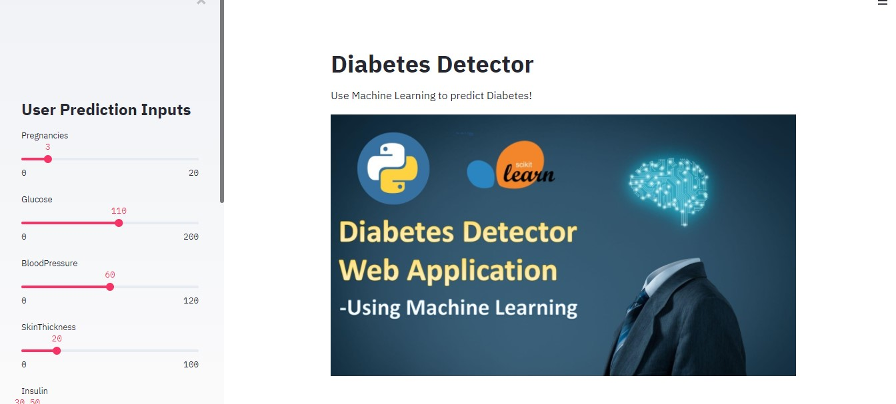

# Diabetes Detector
Use Machine Learning to predict Diabetes!
This web app helps determine if one has diabetes based on the user input metrics
Deplyed in Heroku : [label](https://diabetes-ml-app-2020.herokuapp.com/)

## Screenshots

## Demo

## Instructions
1. Download relevant dependacies by : pip install requirements.txt
2. To run the web service, type streamlit run  diabetes_web_ap.py
3. Select the URL to access the web app
